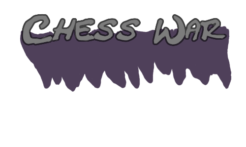

<h1 align="center">
	
     
    
</h1>

Welcome to Chess War's repository.

This is a game that was made as an entry for the 9th <a href="https://develop.games/gamejam/">Pirate Software Game Jam</a>

The theme was <b>Sacrifice Is Strength</b>, and to properlly implement this theme, I decided to create a chess game with an additional component of being able to sacrifice your own pieces in order to level up other pieces and allowing them to get upgrade bonuses and being able to take higher leveled pieces.

&nbsp;

<h1></h1>
<h3 align="center"><b>Support the Creator</b></h4>

 
 
 

